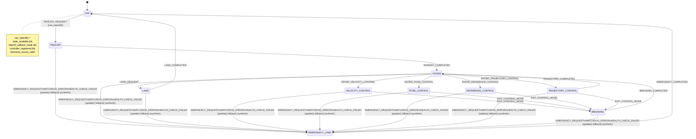

# Sunray FSM State Diagram (Auto-Generated)

Do not edit this file manually. Regenerate with:

```bash
python3 control/uav_control/scripts/gen_fsm_diagram.py --write
```

Parsed from:
- `/home/taolin/Documents/GitHub/Sunray_Refactor/control/uav_control/include/sunray_statemachine/sunray_statemachine.h`
- `/home/taolin/Documents/GitHub/Sunray_Refactor/control/uav_control/src/sunray_statemachine/sunray_statemachine.cpp`



## Validation
- Errors: none
- Warnings: none
